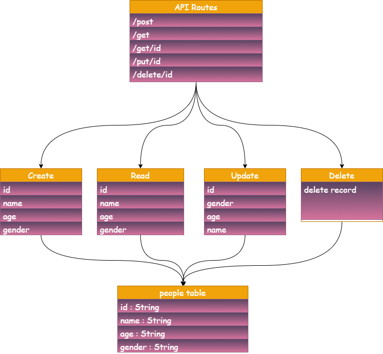

# serverLess API

---

## deploy link :

**[AWS API](https://ugdtwq6o3e.execute-api.us-east-1.amazonaws.com/people)** 

**[Pull Request](https://github.com/ibrahemomari/serverLess/pull/1)** 

---

## Routes:
`/POST` - create new one using req body

`/GET `- get all or include an id parameter to get one

`/PUT` - requires an id parameter and a body including name and phone

`/DELETE` - requires id parameter

---

## UML Diagram:

